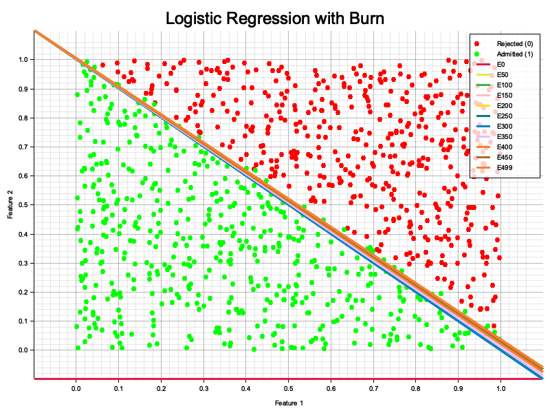

# Gradient-Descent Logistic‑Regression Demo (Rust + Burn)

A tiny Rust project that shows how to:

* generate a **synthetic binary‑classification dataset** on the fly,
* train a **logistic‑regression model** using the [Burn] deep‑learning framework,
* visualise training progress and the learned decision boundary with [Plotters],
* keep the whole pipeline **CPU‑only, dependency‑light, and fully reproducible**.

<p align="center">

---
## ✨ Quick start

```bash
# 1 – Clone the repo at the demo crate
$ git clone https://github.com/Musbell/dl_pytorch_rust_challenge.git
$ cd dl_pytorch_rust_challenge/gradient-descent

# 2 – Build & run (release for speed)
$ cargo run --release

# 3 – Open the generated plot
$ open burn_logistic_plot.png   # macOS (use xdg‑open on Linux)
```

After ~2 s you should see  logs for 500 epochs and a PNG that looks like the screenshot above.

---
## 📂 Project layout

| Path / Module                   | Purpose |
|---------------------------------|---------|
| `main.rs`                       | Orchestrates data generation, training, and plotting. |
| `data.rs`                       | CSV reader that loads the synthetic dataset into memory. |
| `synthetic_data_generator.rs`   | Writes `n` uniformly‑sampled points plus labels to disk. |
| `model.rs`                      | Two‑weight **logistic‑regression** implemented with a single `Linear` layer + `sigmoid`. |
| `train.rs`                      | Training loop (SGD) + accuracy / loss logging + optional boundary plotting every *k* epochs. |
| `plot.rs`                       | Helper functions for drawing the scatter plot and decision lines. |
| `burn_logistic_plot.png`        | Output image (auto‑generated). |

---
## 🔧 Requirements

* **Rust ≥ 1.75** (edition 2021)
* No GPU needed – the demo runs on the **NdArray** backend
* OS‑agnostic

### Cargo dependencies

| Crate        | Why we need it |
|--------------|----------------|
| `burn = "0.16"`  | Autodiff, tensors, optimiser, etc. |
| `plotters = "0.3"` | Publication‑quality plots in pure Rust. |
| `tokio = { features = ["rt-multi-thread", "macros"] }` | Async for file I/O and main entry‑point. |
| `anyhow`     | Ergonomic error handling. |
| `csv`, `serde` | Tiny CSV reader/writer for the dataset. |
| `rand`       | Uniform random point generation. |

All of them are pulled automatically via `cargo run`.

---
## 🚀 How it works

1. **Synthetic data** – `generate_synthetic_csv` draws 1 000 points in \[0,1]^2 and labels them with a hard decision line parameterised by `theta`.
2. **Data loading** – `read_data` maps the CSV into `(features, labels)` *and* two separate point clouds for easy plotting.
3. **Training** – `train_and_plot` constructs tensors, instantiates `LogisticRegression`, then runs plain SGD with a fixed learning‑rate of 0.1 for 500 epochs.
4. **Plotting** – Every 50 epochs we overlay the current decision boundary; at the end we save the chart as `burn_logistic_plot.png`.

---
## ⚙️ Customisation

| What to tweak | Where | Effect |
|---------------|-------|--------|
| `NUM_SAMPLES` | `main.rs` | Size of the dataset (heavier runs increase training time). |
| `EPOCHS`      | `main.rs` | Length of training and number of boundary snapshots. |
| `LR`          | `main.rs` | SGD learning rate (try 0.01–1.0). |
| `theta`       | `main.rs` | Underlying ground‑truth line separating the classes. |
| Backend       | `type MyNd` in `main.rs` | Swap `NdArray` for another Burn backend (e.g. `tch`). |


---
**Happy tinkering!** If you hit a snag, feel free to open an issue or ping @Musbell.

[Burn]: https://github.com/burn-rs/burn
[Plotters]: https://github.com/plotters-rs/plotters

