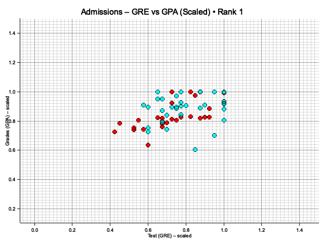
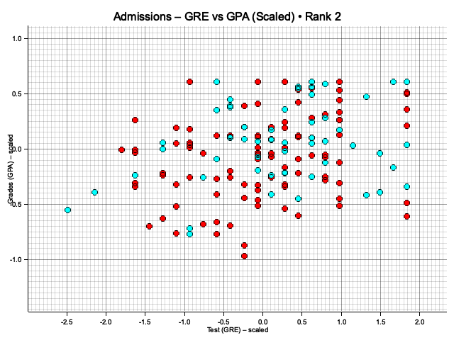
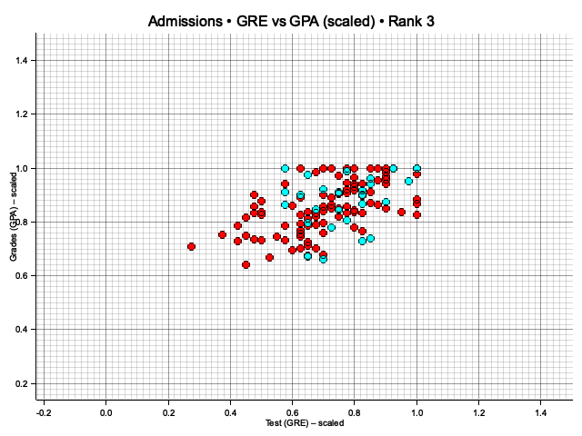
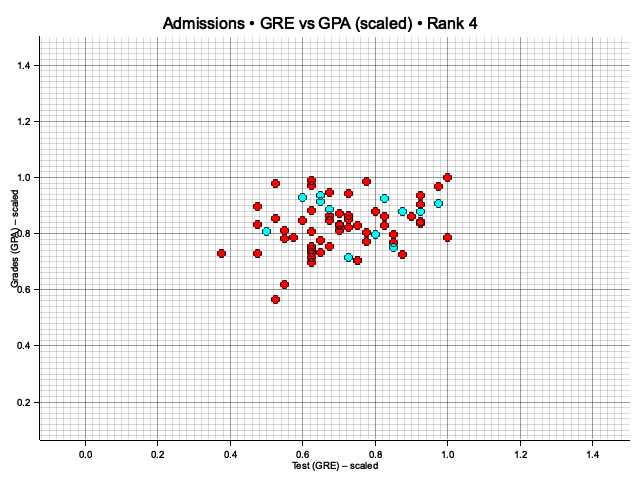

# Student‑Admissions ‑ Logistic Regression in Pure Rust

This crate demonstrates an end‑to‑end machine‑learning workflow in
**Rust**:

| Stage | Crate / module | Highlights |
|-------|----------------|------------|
| CSV → struct | `data` | `serde` deserialization |
| One‑hot encoding + scaling | `data::AdmissionsOps` | zero‑copy conversion |
| Train/test split (reproducible) | generic over **any** `RngCore` |
| Batch gradient descent | `train` | pluggable loss (`BCE`, `MSE`) |
| Scatter plots | `plot` | `plotters` backend |
| CLI driver | `main.rs` | Tokio async for FS ops |

---

## 1  Quick start

To build and run the project in release mode, use the following command:

```bash
cargo run --release -p student-admissions
```

You should see output similar to this, showing the data preview, training progress, and final accuracy:

```text
=== RAW (first 5 rows) ===
admit  gre  gpa rank
    0  380 3.61    3
    1  660 3.67    3
    1  800    4    1
    1  640 3.19    4
    0  520 2.93    4

=== ONE‑HOT + SCALED (first 5 rows) ===
admit      gre      gpa  r1  r2  r3  r4
    0   0.4750   0.9025   0   0   1   0
    1   0.8250   0.9175   0   0   1   0
    1   1.0000   1.0000   1   0   0   0
    1   0.8000   0.7975   0   0   0   1
    0   0.6500   0.7325   0   0   0   1
epoch    0 – loss 0.670074
epoch 1000 – loss 0.596616
# ... (output for other epochs) ...
epoch 9000 – loss 0.585843
prediction accuracy: 0.740
```

Four PNG scatter‑plots (`admissions_rank*.png`), visualizing the scaled data colored by admission status for each rank, will be generated under the `student-admissions/plots/` directory.






---

## 2  Data pipeline

The data processing and training pipeline follows these steps:

```
flowchart LR
    A[CSV\n(student_data.csv)]
    B[one_hot_rank()]
    C[scale_mut()]
    D[split_train_test(…)]
    E[train_nn()]
    A --> B --> C --> D
    D -->|train| E
    D -->|test|  E
```

*   **One‑hot encoding:** The categorical `rank` column (1-4) is converted into four binary dummy variables (`r1` through `r4`). This is necessary because logistic regression models work best with numerical features.
*   **Scaling:** The `gre` (Graduate Record Exam score) and `gpa` (Grade Point Average) features are scaled to a range approximately between 0 and 1. This helps gradient descent converge faster. `gre` is scaled by dividing by 800, and `gpa` is scaled by dividing by 4.
*   **Reproducible Split:** The dataset is split into training and testing sets. A seeded random number generator (`rand::rngs::StdRng` seeded with 42) is used to ensure the split is the same every time the program is run, making the results reproducible. The split size is configurable (defaulting to 25% for testing).

---

## 3  Training details

The logistic regression model is trained using Batch Gradient Descent with the following hyper-parameters:

| Hyper‑parameter            | Value                                | Details                                      |
| :------------------------- | :----------------------------------- | :------------------------------------------- |
| Model                      | single‑layer logistic regression     | Predicts `admit` based on 6 features (`gre`, `gpa`, `r1`‑`r4`). |
| Epochs                     | 10 000                               | Number of full passes over the training data. |
| Learning rate              | 5 × 10<sup>‑4</sup>                  | Controls the step size during gradient descent. |
| Loss                       | Binary Cross Entropy (`BCE`)         | Measures the performance of the classification model. |
| Weight init                | 𝒩(0, 1/√d), seeded RNG `StdRng(42)` | Weights are initialized from a normal distribution with mean 0 and standard deviation 1/√d, where d is the number of features. Seeded for reproducibility. |
| Accuracy (25 % test split) | **74 %**                             | Achieved accuracy on the held-out test set. |

You can experiment with using Mean Squared Error (`MSE`) as the loss function instead of BCE by changing the type parameter in the `train_nn` function call in `main.rs`:

```rust
// In src/main.rs
// Before:
let weights = train_nn::<BCE>(&XY { x: x_train, y: y_train }, epochs, lr)?;

// After:
use model::MSE; // Ensure MSE is imported if not already
let weights = train_nn::<MSE>(&XY { x: x_train, y: y_train }, epochs, lr)?;
```
*Note: MSE is not typically used for binary classification and may yield worse results.*

---

## 4  Project layout

The project is structured into several modules, each responsible for a specific part of the machine learning pipeline:

```text
student-admissions/
├── src/
│   ├── data.rs      # Data loading, preprocessing (one-hot, scaling), and splitting
│   ├── train.rs     # Implements the batch gradient descent training algorithm
│   ├── plot.rs      # Contains logic for generating scatter plots using 'plotters'
│   ├── model.rs     # Defines traits for Activation and Loss functions (Sigmoid, BCE, MSE)
│   └── main.rs      # The command-line entry point, orchestrating the pipeline
├── student_data.csv # The raw input data file
└── plots/           # Directory where generated PNG plots are saved (created if it doesn't exist)
```

You can find the full source code for each module in the respective `.rs` files within the `src/` directory.